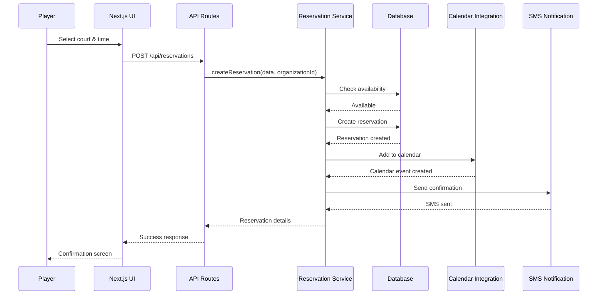

# Multi-Tenant SaaS Architecture for Pickleball Business Management Platform

## Overview

This document outlines the system architecture for a multi-tenant SaaS platform designed for pickleball business management. The platform enables organizations (pickleball businesses) to create websites where players can manage memberships and reserve courts.

The architecture is presented in two parts:
1. **North Star Architecture** - The complete vision for the platform
2. **First Implementation Slice** - The initial implementation focused on organization signup

## Terminology

- **Organization** - A business entity that manages one or more pickleball facilities (replaces the generic term "tenant")
- **Facility** - A physical location with pickleball courts managed by an organization
- **Player** - An end-user who makes court reservations and participates in events
- **Admin** - A user with administrative privileges for an organization

## North Star Architecture

### 1. Multi-Tenant Data Model and Isolation Strategy

For a platform that needs to scale to 100+ organizations with extensive customization, we recommend a **shared database with organization ID approach**:

#### Key Components:

1. **Organization Identification**:
   - Each organization has a unique identifier
   - Organization ID is included in relevant tables as a foreign key
   - All queries include organization ID filtering to ensure data isolation

2. **Database Schema**:
   - PostgreSQL with row-level security policies to enforce organization isolation
   - Shared tables with organization_id column in relevant tables
   - Indexes on organization_id + other frequently queried columns for performance

3. **Organization Configuration**:
   - Separate configuration table for organization-specific settings
   - JSON/JSONB columns for flexible configuration storage
   - Cached configuration for performance

4. **Data Access Patterns**:
   - Middleware that automatically injects organization context into all queries
   - Repository pattern that abstracts organization filtering logic
   - Query builders that enforce organization isolation

#### Vercel Integration:
- Utilize Vercel Postgres for managed database service
- Leverage Vercel Edge Config for organization-specific configuration
- Use Vercel KV for caching frequently accessed organization data

### 2. Authentication and Authorization Framework

For a platform requiring multi-tenant authentication with extensive customization:

#### Key Components:

1. **Authentication Flow**:
   - Clerk or Auth.js (NextAuth) for identity management with organization context
   - JWT tokens containing organization identifier and user roles
   - Custom login pages branded per organization
   - Social login options with organization-specific configurations

2. **Role-Based Access Control (RBAC)**:
   - Core roles: Super Admin (platform-wide), Organization Admin, Staff, Player
   - Hierarchical permission structure
   - Role assignments stored in organization-specific tables

3. **Organization-specific Permissions**:
   - Permission definitions stored in configuration
   - Feature flags tied to permissions
   - UI components conditionally rendered based on permissions

4. **Middleware Implementation**:
   - Next.js middleware to validate authentication on all routes
   - Organization context extraction from JWT tokens
   - Route protection based on organization + role combinations

#### Vercel Integration:
- Use Vercel Edge Middleware for authentication checks
- Leverage Vercel Edge Config for storing organization-specific auth settings
- Utilize Vercel Edge Functions for token validation and processing

### 3. API Design and Service Layer Architecture

For a platform that needs to handle court reservations, memberships, and various integrations:

#### Key Components:

1. **API Structure**:
   - REST API using Next.js API routes for core functionality
   - tRPC for type-safe API calls
   - Webhook endpoints for external service integrations

2. **Service Boundaries**:
   - Core services: Reservation, Membership, Payment, User, Court, Event
   - Each service has its own repository and business logic
   - Services communicate through well-defined interfaces

3. **Organization Context Propagation**:
   - Middleware extracts organization ID from authenticated requests
   - Organization context passed to all service calls
   - Context maintained across asynchronous operations

4. **Integration Architecture**:
   - Adapter pattern for external service integrations
   - Queue-based processing for asynchronous operations
   - Retry mechanisms for resilience

#### Vercel Integration:
- Utilize Vercel Serverless Functions for API routes
- Leverage Vercel Edge Functions for performance-critical operations
- Use Vercel Cron Jobs for scheduled tasks and background processing

### 4. State Management Approach

For a platform with complex UI requirements and organization-specific customizations:

#### Key Components:

1. **Client-side State Management**:
   - React Context API for global UI state
   - Zustand for more complex state with actions
   - Organization-specific state isolated by design

2. **Server State Management**:
   - SWR or React Query for server state with organization-aware caching
   - Automatic cache invalidation based on organization context
   - Optimistic updates for better UX

3. **Form Management**:
   - React Hook Form for efficient form handling
   - Zod for schema validation
   - Organization-specific form configurations

4. **URL State**:
   - Next.js router for navigation state
   - Query parameters for shareable state
   - Deep linking support for better UX

#### Vercel Integration:
- Use Vercel Edge Config for feature flags and UI configuration
- Leverage Vercel Analytics for tracking user interactions
- Utilize Vercel Speed Insights for performance monitoring

### 5. System Architecture Diagrams

#### Overall System Architecture

#### Data Flow for Court Reservation

#### Entity Relationship Diagram

### Technology Recommendations

Based on the requirements and architecture design, we recommend the following technologies within the Next.js ecosystem, with a focus on Vercel's platform offerings:

1. **Frontend**:
   - Next.js 14+ with App Router for improved routing and layouts
   - React Server Components for improved performance
   - Tailwind CSS for styling (with organization-specific theme configuration)
   - Headless UI components for accessibility and customization

2. **Authentication**:
   - Clerk or Auth.js (NextAuth) for multi-tenant authentication
   - Next.js middleware for route protection
   - JWT for secure token-based authentication

3. **State Management**:
   - React Context API for global UI state
   - Zustand for complex state management
   - SWR for server state and caching

4. **Database**:
   - Vercel Postgres for relational data with JSONB for flexible schema
   - Prisma ORM for type-safe database access
   - Vercel KV for caching and session storage

5. **API**:
   - REST API with Next.js API routes for core functionality
   - tRPC for type-safe API calls

6. **Deployment & Infrastructure**:
   - Vercel for hosting and serverless functions
   - Vercel Edge Functions for performance-critical operations
   - Vercel Analytics for monitoring
   - Vercel Cron Jobs for scheduled tasks

7. **Integration**:
   - Stripe for payment processing
   - Resend for email notifications
   - Twilio for SMS notifications
   - Google Calendar API for calendar integration

## First Implementation Slice: Organization Signup

For the initial implementation, we'll focus on enabling organizations to sign up for the platform. This provides a foundation for the multi-tenant architecture while delivering immediate value.

### Core Features for First Slice

1. Organization signup and onboarding
2. Basic organization profile management
3. Admin user creation and authentication
4. Simple facility creation

### Simplified Architecture for First Slice

### Data Model for First Slice

### Implementation Details for First Slice

1. **Organization Signup Flow**:
   - Simple signup form collecting organization name, admin email, and password
   - Email verification using Resend
   - Organization creation in database with unique slug generation
   - Initial admin user creation with owner role

2. **Authentication Implementation**:
   - Clerk or Auth.js setup with organization context
   - JWT tokens with organization ID claim
   - Simple middleware for route protection

3. **Admin Dashboard**:
   - Organization profile management (name, contact info, logo)
   - Facility creation and management (name, address, contact info)
   - Admin user management (invite additional admins)

4. **Database Setup**:
   - Vercel Postgres with basic schema for organizations, users, and facilities
   - Simple row-level security policies for organization isolation

5. **Vercel-specific Optimizations**:
   - Vercel Postgres for database
   - Vercel Blob Storage for organization logos and assets
   - Vercel Edge Config for feature flags and configuration
   - Vercel Analytics for basic usage tracking

### Evolution Path

This first slice establishes the foundation for the multi-tenant architecture while delivering immediate value. From here, we can evolve the platform by adding:

1. Court management and reservation system
2. Player accounts and membership management
3. Payment processing integration
4. Calendar integration
5. More advanced customization options
6. Additional integrations (SMS, ranking systems, etc.)

Each feature can be implemented as a vertical slice, building on the multi-tenant foundation established in the first implementation.