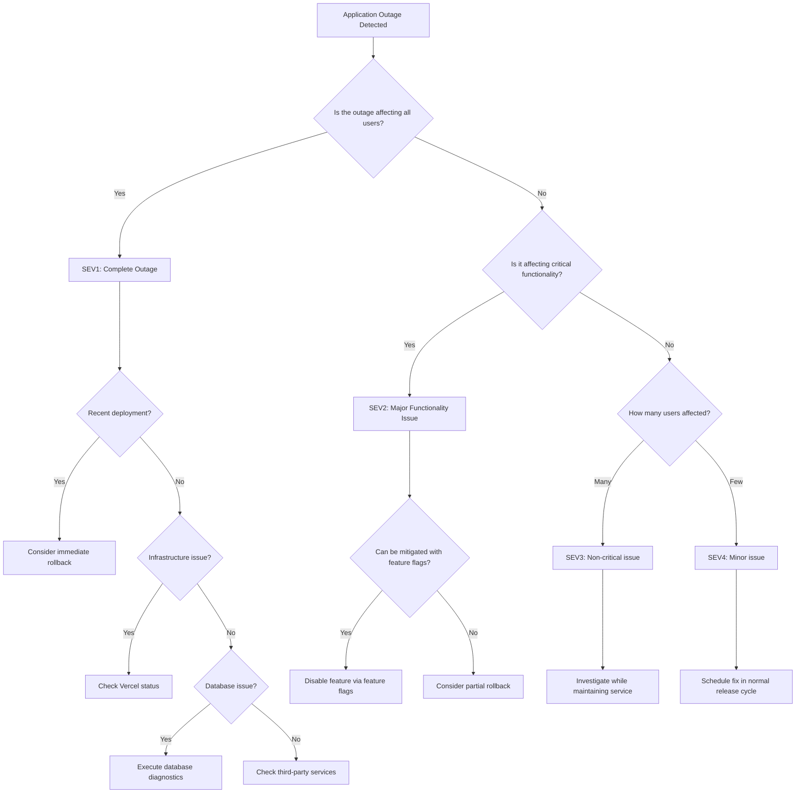

# Application Outage Incident Response Playbook

This playbook provides step-by-step procedures for responding to application outages in our Next.js application deployed on Vercel.

## Table of Contents

1. [Incident Definition](#incident-definition)
2. [Detection Methods](#detection-methods)
3. [Initial Assessment](#initial-assessment)
4. [Diagnostic Procedures](#diagnostic-procedures)
5. [Resolution Strategies](#resolution-strategies)
6. [Feature Flag Strategies](#feature-flag-strategies)
7. [Verification Steps](#verification-steps)
8. [Decision Tree](#decision-tree)
9. [Communication Templates](#communication-templates)
10. [Post-Incident Tasks](#post-incident-tasks)

## Incident Definition

An application outage is defined as any situation where users are unable to access or use the application or its critical features. This can range from a complete system-wide outage to specific feature unavailability.

**Potential Severity Levels:**
- **SEV1**: Complete application unavailability for all users
- **SEV2**: Major functionality unavailable for a significant subset of users
- **SEV3**: Non-critical functionality unavailable for some users
- **SEV4**: Minor functionality issues with minimal user impact

## Detection Methods

Application outages can be detected through:

### Automated Monitoring

1. **Error Rate Monitoring**
   - Sentry error tracking
   - Vercel Analytics error metrics
   - Custom error tracking in application logs

2. **Availability Monitoring**
   - Health check endpoint monitoring
   - Synthetic user journey tests
   - API endpoint monitoring

3. **Performance Monitoring**
   - Page load time metrics
   - API response time metrics
   - Server-side rendering time metrics

### Manual Reports

1. **User Reports**
   - Customer support tickets
   - Social media mentions
   - Direct emails or calls

2. **Internal Reports**
   - Team member observations
   - Dogfooding discoveries
   - Stakeholder reports

## Initial Assessment

When an application outage is detected, follow these steps for initial assessment:

1. **Confirm the Issue**
   - Verify the issue exists by accessing the application
   - Check if the issue is reproducible
   - Determine if the issue is isolated or widespread

2. **Assess Severity**
   - Determine the percentage of users affected
   - Identify which functionality is impacted
   - Evaluate business impact
   - Assign appropriate severity level (SEV1-SEV4)

3. **Assemble Response Team**
   - Incident Commander
   - Technical Lead
   - Operations Lead
   - Communications Lead (for SEV1/SEV2)
   - Other roles as needed based on severity

4. **Establish Communication Channels**
   - Create incident Slack channel
   - Set up video conference bridge (for SEV1/SEV2)
   - Notify stakeholders based on severity level

## Diagnostic Procedures

### System-Wide Diagnostics

1. **Infrastructure Check**
   - Verify Vercel deployment status
   - Check for Vercel platform issues
   - Review infrastructure metrics (CPU, memory, network)
   - Verify domain and DNS configuration

2. **Database Check**
   - Verify database connectivity
   - Check database performance metrics
   - Review recent database changes
   - Check for database locks or long-running queries

3. **Third-Party Service Check**
   - Verify status of critical third-party services
   - Check authentication provider status
   - Review payment processor status (if applicable)
   - Check API gateway status

### Application-Specific Diagnostics

1. **Run Smoke Tests**
   ```bash
   # Run all smoke tests
   cd /path/to/project
   npx ts-node web/prod-tests/smoke/run-smoke-tests.ts
   
   # Run specific smoke test
   npx ts-node web/prod-tests/smoke/auth-smoke-test.ts
   ```

2. **Check Application Logs**
   - Review Vercel deployment logs
   - Check application error logs
   - Review recent deployments

3. **Review Recent Changes**
   - Identify recent code deployments
   - Review recent configuration changes
   - Check for recent database migrations

## Resolution Strategies

### Quick Mitigation Strategies

1. **Restart Application**
   - For Vercel deployments, redeploy the application
   ```bash
   # Redeploy using Vercel CLI
   vercel deploy --prod
   ```

2. **Scale Resources**
   - Increase serverless function concurrency
   - Scale database resources if needed

3. **Enable Maintenance Mode**
   - If available, enable maintenance mode to communicate with users

### Rollback Procedures

1. **Code Rollback**
   - Identify the last known good deployment
   - Execute rollback via Vercel dashboard or API
   ```javascript
   // Example Vercel API rollback implementation
   import { Vercel } from "@vercel/sdk";
   
   const vercel = new Vercel({
     bearerToken: process.env.VERCEL_TOKEN,
   });
   
   async function rollbackDeployment(projectId, deploymentId) {
     try {
       // Get the last successful deployment before the problematic one
       const deployments = await vercel.deployments.listDeployments({
         projectId,
         limit: 10,
       });
       
       const lastGoodDeployment = deployments.find(d => 
         d.state === "READY" && d.id !== deploymentId
       );
       
       if (!lastGoodDeployment) {
         throw new Error("No suitable deployment found for rollback");
       }
       
       // Rollback to the last good deployment
       await vercel.aliases.updateAlias({
         aliasId: "production",
         deploymentId: lastGoodDeployment.id,
       });
       
       console.log(`Rolled back to deployment ${lastGoodDeployment.id}`);
       return lastGoodDeployment.id;
     } catch (error) {
       console.error("Rollback failed:", error);
       throw error;
     }
   }
   ```

2. **Database Rollback**
   - If the issue is related to a recent database migration, execute the down migration
   ```javascript
   // Example database rollback script
   import { execSync } from 'child_process';
   import { PrismaClient } from '@prisma/client';
   
   const prisma = new PrismaClient();
   
   async function rollbackMigration(migrationName) {
     try {
       // Generate down migration SQL
       const downSql = execSync(`
         npx prisma migrate diff \
           --from-schema-datamodel prisma/schema.prisma \
           --to-migrations prisma/migrations \
           --script > down.sql
       `);
       
       // Execute down migration
       await prisma.$executeRawUnsafe(`
         -- Execute down migration SQL
         ${downSql}
         
         -- Update migration history
         DELETE FROM _prisma_migrations 
         WHERE migration_name = '${migrationName}';
       `);
       
       console.log(`Migration ${migrationName} rolled back successfully`);
     } catch (error) {
       console.error("Migration rollback failed:", error);
       
       // Attempt to restore from backup if rollback fails
       await restoreFromBackup();
       
       throw error;
     }
   }
   ```

3. **Configuration Rollback**
   - Revert environment variables to previous values
   ```javascript
   // Example configuration rollback
   import { Vercel } from "@vercel/sdk";
   
   const vercel = new Vercel({
     bearerToken: process.env.VERCEL_TOKEN,
   });
   
   async function rollbackConfiguration(projectId, configVersion) {
     try {
       // Get configuration history
       const configHistory = await vercel.projects.getProjectEnvVars({
         projectId,
       });
       
       // Find the target configuration version
       const targetConfig = configHistory.find(c => c.version === configVersion);
       
       if (!targetConfig) {
         throw new Error(`Configuration version ${configVersion} not found`);
       }
       
       // Apply the target configuration
       await vercel.projects.updateProjectEnvVars({
         projectId,
         envVars: targetConfig.envVars,
       });
       
       console.log(`Configuration rolled back to version ${configVersion}`);
     } catch (error) {
       console.error("Configuration rollback failed:", error);
       throw error;
     }
   }
   ```

### Long-Term Resolution

1. **Fix and Deploy**
   - Identify root cause
   - Develop fix
   - Test fix thoroughly
   - Deploy fix with appropriate safeguards

2. **Infrastructure Improvements**
   - Implement redundancy
   - Improve scaling capabilities
   - Enhance monitoring and alerting

## Feature Flag Strategies

Feature flags can be used to mitigate application outages:

1. **Disable Problematic Features**
   ```typescript
   // Server-side code
   import { featureFlagService } from '@/lib/feature-flags/feature-flag-service';
   
   // Disable the problematic feature
   await featureFlagService.updateFlag('problematic_feature', {
     enabled: false,
     description: 'Disabled due to production issue on [date]'
   });
   ```

2. **Enable Fallback Features**
   ```tsx
   // React component with fallback
   import { FeatureFlag, FeatureFlagOff } from '@/components/feature-flags/feature-flag';
   
   function MyComponent() {
     return (
       <div>
         <FeatureFlag flag="new_feature">
           <NewFeatureImplementation />
         </FeatureFlag>
         
         <FeatureFlagOff flag="new_feature">
           <LegacyImplementation />
         </FeatureFlagOff>
       </div>
     );
   }
   ```

3. **Percentage Rollout Reduction**
   ```typescript
   // Reduce percentage rollout to limit impact
   await featureFlagService.updateFlag('new_feature', {
     enabled: true,
     percentage: 10, // Reduce from higher percentage
     description: 'Reduced rollout due to performance issues'
   });
   ```

## Verification Steps

After implementing resolution strategies, verify the fix:

1. **Basic Verification**
   - Access the application
   - Test critical user flows
   - Verify error rates have decreased
   - Check performance metrics

2. **Automated Verification**
   - Run smoke tests
   ```bash
   npx ts-node web/prod-tests/smoke/run-smoke-tests.ts
   ```
   
   - Run targeted load tests
   ```bash
   npx ts-node web/prod-tests/load/run-load-tests.ts
   ```

3. **User Verification**
   - Confirm with affected users that the issue is resolved
   - Monitor support channels for continued reports

## Decision Tree

Use this decision tree to guide your response to application outages:



### Decision Points

1. **Is the outage affecting all users?**
   - If yes, treat as SEV1
   - If no, continue assessment

2. **Is it affecting critical functionality?**
   - If yes, treat as SEV2
   - If no, continue assessment

3. **Recent deployment?**
   - If yes, consider immediate rollback
   - If no, investigate other causes

4. **Infrastructure issue?**
   - If yes, check Vercel status and infrastructure
   - If no, investigate application issues

5. **Database issue?**
   - If yes, execute database diagnostics
   - If no, check third-party services

6. **Can be mitigated with feature flags?**
   - If yes, disable feature via feature flags
   - If no, consider partial rollback

## Communication Templates

### Internal Communication

#### Initial Notification

```
@channel INCIDENT DECLARED: Application Outage

Severity: [SEV1/SEV2/SEV3/SEV4]
Time Detected: [Time]
Detected By: [Name/System]

Description:
[Brief description of the outage]

Impact:
- [% of users affected]
- [Functionality affected]
- [Business impact]

Current Status:
- Investigation in progress
- Response team assembled
- [Other relevant status information]

Next Update:
[Time of next update]

Incident Channel: #incident-[date]-application-outage
```

#### Status Update

```
@channel INCIDENT UPDATE: Application Outage

Time: [Time]
Elapsed Time: [Time since incident started]

Current Status:
- [Current state of the application]
- [Progress made]
- [Ongoing issues]

Actions Taken:
- [List of actions taken]

Next Steps:
- [Planned actions]

Estimated Resolution Time:
[ETA if known, or "Under investigation"]

Next Update:
[Time of next update]
```

#### Resolution Notification

```
@channel INCIDENT RESOLVED: Application Outage

Time Resolved: [Time]
Total Duration: [Duration]

Resolution:
[Description of how the issue was resolved]

Root Cause:
[Brief description of the root cause, if known]

Impact Summary:
- [% of users affected]
- [Duration of impact]
- [Business impact]

Follow-up:
- Post-incident review scheduled for [time/date]
- [Any immediate follow-up actions]

Thank you to everyone who helped resolve this incident.
```

### External Communication

#### Status Page Update - Initial

```
[Title: Application Outage]

Status: Investigating

We are currently experiencing an issue with [specific functionality or "our application"]. Our team is investigating the issue and working to restore service as quickly as possible.

We will provide updates as more information becomes available.

Time: [Time]
```

#### Status Page Update - Progress

```
[Title: Application Outage]

Status: Identified

We have identified the cause of the current outage and are implementing a fix. We expect to restore service within [estimated time].

We apologize for the inconvenience and appreciate your patience.

Time: [Time]
```

#### Status Page Update - Resolution

```
[Title: Application Outage]

Status: Resolved

The issue affecting [specific functionality or "our application"] has been resolved. All systems are now operating normally.

We apologize for any inconvenience this may have caused.

Time: [Time]
```

## Post-Incident Tasks

1. **Schedule Post-Incident Review**
   - Schedule within timeframe specified by severity level
   - Include all response team members
   - Invite relevant stakeholders

2. **Prepare Post-Incident Report**
   - Document timeline of events
   - Record actions taken
   - Identify root cause
   - Assess response effectiveness
   - List lessons learned

3. **Implement Preventive Measures**
   - Develop action items to prevent recurrence
   - Assign owners to action items
   - Set deadlines for implementation
   - Schedule follow-up review

4. **Update Playbook**
   - Incorporate lessons learned
   - Update procedures as needed
   - Improve decision tree based on experience
   - Add new communication templates if needed