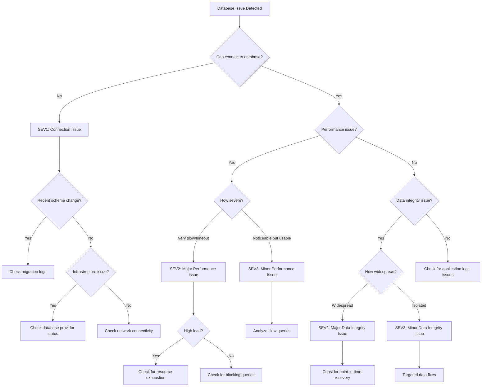

# Database Issues Incident Response Playbook

This playbook provides step-by-step procedures for responding to database issues in our Next.js application deployed on Vercel with Prisma ORM.

## Table of Contents

1. [Incident Definition](#incident-definition)
2. [Detection Methods](#detection-methods)
3. [Initial Assessment](#initial-assessment)
4. [Diagnostic Procedures](#diagnostic-procedures)
5. [Resolution Strategies](#resolution-strategies)
6. [Data Integrity Verification](#data-integrity-verification)
7. [Decision Tree](#decision-tree)
8. [Communication Templates](#communication-templates)
9. [Post-Incident Tasks](#post-incident-tasks)

## Incident Definition

Database issues are defined as any problems affecting the database's availability, performance, or data integrity. These issues can range from complete database unavailability to data corruption or performance degradation.

**Potential Severity Levels:**
- **SEV1**: Database completely unavailable or severe data corruption affecting all users
- **SEV2**: Database performance severely degraded or data integrity issues affecting a significant subset of users
- **SEV3**: Minor database performance issues or isolated data integrity issues
- **SEV4**: Minimal database issues with negligible user impact

## Detection Methods

Database issues can be detected through:

### Automated Monitoring

1. **Performance Monitoring**
   - Query execution time metrics
   - Connection pool utilization
   - Database CPU and memory usage
   - Disk I/O and storage metrics

2. **Error Monitoring**
   - Database connection errors
   - Query timeout errors
   - Constraint violation errors
   - Deadlock detection

3. **Data Integrity Monitoring**
   - Schema validation checks
   - Data consistency checks
   - Referential integrity checks

### Manual Reports

1. **User Reports**
   - Data inconsistency reports
   - Slow performance reports
   - Feature failure reports related to data access

2. **Internal Reports**
   - Developer observations during testing
   - Operations team monitoring
   - Data analysis findings

## Initial Assessment

When a database issue is detected, follow these steps for initial assessment:

1. **Confirm the Issue**
   - Verify the issue exists by running diagnostic queries
   - Check if the issue is reproducible
   - Determine if the issue is isolated to specific queries or tables

2. **Assess Severity**
   - Determine the percentage of users affected
   - Identify which functionality is impacted
   - Evaluate business impact
   - Assign appropriate severity level (SEV1-SEV4)

3. **Assemble Response Team**
   - Incident Commander
   - Technical Lead (with database expertise)
   - Operations Lead
   - Communications Lead (for SEV1/SEV2)
   - Other roles as needed based on severity

4. **Establish Communication Channels**
   - Create incident Slack channel
   - Set up video conference bridge (for SEV1/SEV2)
   - Notify stakeholders based on severity level

## Diagnostic Procedures

### Basic Diagnostics

1. **Connection Verification**
   ```typescript
   // Verify database connection
   import { PrismaClient } from '@prisma/client';
   
   async function checkDatabaseConnection() {
     const prisma = new PrismaClient();
     try {
       // Simple query to check connection
       const result = await prisma.$queryRaw`SELECT 1 as alive`;
       console.log('Database connection successful:', result);
       return true;
     } catch (error) {
       console.error('Database connection failed:', error);
       return false;
     } finally {
       await prisma.$disconnect();
     }
   }
   ```

2. **Database Status Check**
   - Check database provider status page
   - Verify database instance status
   - Check for maintenance windows or planned outages

3. **Recent Changes Review**
   - Review recent schema migrations
   - Check for recent data imports or bulk operations
   - Review application code changes affecting database access

### Advanced Diagnostics

1. **Performance Analysis**
   ```sql
   -- Check for slow queries
   SELECT query, calls, total_time, mean_time
   FROM pg_stat_statements
   ORDER BY mean_time DESC
   LIMIT 10;
   
   -- Check for table bloat
   SELECT
     schemaname, relname,
     n_live_tup, n_dead_tup,
     round(n_dead_tup * 100.0 / (n_live_tup + n_dead_tup + 1), 2) AS dead_percentage
   FROM pg_stat_user_tables
   WHERE n_dead_tup > 0
   ORDER BY dead_percentage DESC;
   
   -- Check for locks
   SELECT relation::regclass, mode, granted, pid, pg_blocking_pids(pid) as blocked_by
   FROM pg_locks
   WHERE NOT granted OR pg_blocking_pids(pid) <> '{}';
   ```

2. **Connection Pool Analysis**
   ```sql
   -- Check active connections
   SELECT count(*) FROM pg_stat_activity WHERE state = 'active';
   
   -- Check connection distribution
   SELECT usename, count(*) 
   FROM pg_stat_activity 
   GROUP BY usename;
   
   -- Check long-running queries
   SELECT pid, now() - query_start as duration, query
   FROM pg_stat_activity
   WHERE state = 'active' AND now() - query_start > interval '5 minutes'
   ORDER BY duration DESC;
   ```

3. **Data Integrity Checks**
   ```typescript
   // Example data integrity check for a specific table
   import { PrismaClient } from '@prisma/client';
   
   async function checkUserDataIntegrity() {
     const prisma = new PrismaClient();
     try {
       // Check for orphaned records
       const orphanedProfiles = await prisma.profile.findMany({
         where: {
           user: {
             is: null
           }
         }
       });
       
       // Check for duplicate emails
       const duplicateEmails = await prisma.$queryRaw`
         SELECT email, COUNT(*) 
         FROM "User" 
         GROUP BY email 
         HAVING COUNT(*) > 1
       `;
       
       return {
         orphanedProfiles: orphanedProfiles.length,
         duplicateEmails: duplicateEmails.length
       };
     } catch (error) {
       console.error('Data integrity check failed:', error);
       throw error;
     } finally {
       await prisma.$disconnect();
     }
   }
   ```

## Resolution Strategies

### Quick Mitigation Strategies

1. **Restart Database Connection Pool**
   ```typescript
   // Restart Prisma connection pool
   import { PrismaClient } from '@prisma/client';
   
   const prisma = new PrismaClient();
   
   async function restartConnectionPool() {
     try {
       await prisma.$disconnect();
       // Reconnect by making a simple query
       await prisma.$queryRaw`SELECT 1`;
       console.log('Connection pool restarted successfully');
     } catch (error) {
       console.error('Failed to restart connection pool:', error);
       throw error;
     }
   }
   ```

2. **Kill Problematic Queries**
   ```sql
   -- Identify long-running queries
   SELECT pid, now() - query_start as duration, query
   FROM pg_stat_activity
   WHERE state = 'active' AND now() - query_start > interval '5 minutes'
   ORDER BY duration DESC;
   
   -- Kill a specific query
   SELECT pg_cancel_backend(pid);
   
   -- Kill a specific connection
   SELECT pg_terminate_backend(pid);
   ```

3. **Scale Database Resources**
   - Increase database instance size
   - Add read replicas for read-heavy workloads
   - Adjust connection pool size

### Database Rollback Procedures

1. **Schema Rollback**
   ```bash
   # Generate down migration SQL
   npx prisma migrate diff \
     --from-schema-datamodel prisma/schema.prisma \
     --to-migrations prisma/migrations \
     --script > down.sql
   
   # Apply down migration
   npx prisma db execute --file down.sql
   
   # Update migration history
   npx prisma migrate resolve --rolled-back [migration_name]
   ```

2. **Data Restoration from Backup**
   ```bash
   # For Vercel Postgres, use the Vercel dashboard to restore from a backup
   # For custom database providers, follow their specific restoration procedures
   
   # After restoration, verify data integrity
   npx ts-node scripts/verify-data-integrity.ts
   ```

3. **Point-in-Time Recovery**
   - Identify the point in time before the issue occurred
   - Use database provider's point-in-time recovery feature
   - Verify data integrity after recovery

### Long-Term Resolution

1. **Database Optimization**
   - Add appropriate indexes
   - Optimize slow queries
   - Implement query caching
   - Consider database sharding for large datasets

2. **Schema Improvements**
   - Normalize/denormalize as appropriate
   - Add constraints to prevent data integrity issues
   - Implement soft deletes where appropriate

3. **Connection Management**
   - Optimize connection pool settings
   - Implement connection timeouts
   - Add retry logic for transient errors

## Data Integrity Verification

After resolving database issues, verify data integrity:

1. **Basic Verification**
   ```typescript
   // Basic data integrity checks
   import { PrismaClient } from '@prisma/client';
   
   async function verifyBasicDataIntegrity() {
     const prisma = new PrismaClient();
     try {
       // Check record counts
       const userCount = await prisma.user.count();
       const profileCount = await prisma.profile.count();
       const postCount = await prisma.post.count();
       
       console.log(`Record counts: Users=${userCount}, Profiles=${profileCount}, Posts=${postCount}`);
       
       // Check for critical records
       const adminUsers = await prisma.user.count({
         where: { role: 'ADMIN' }
       });
       
       console.log(`Admin users: ${adminUsers}`);
       
       return {
         userCount,
         profileCount,
         postCount,
         adminUsers
       };
     } catch (error) {
       console.error('Data integrity verification failed:', error);
       throw error;
     } finally {
       await prisma.$disconnect();
     }
   }
   ```

2. **Relationship Verification**
   ```typescript
   // Verify relationships between tables
   async function verifyRelationships() {
     const prisma = new PrismaClient();
     try {
       // Check for orphaned records
       const orphanedProfiles = await prisma.profile.count({
         where: {
           user: {
             is: null
           }
         }
       });
       
       const orphanedPosts = await prisma.post.count({
         where: {
           author: {
             is: null
           }
         }
       });
       
       console.log(`Orphaned records: Profiles=${orphanedProfiles}, Posts=${orphanedPosts}`);
       
       return {
         orphanedProfiles,
         orphanedPosts
       };
     } catch (error) {
       console.error('Relationship verification failed:', error);
       throw error;
     } finally {
       await prisma.$disconnect();
     }
   }
   ```

3. **Business Logic Verification**
   ```typescript
   // Verify business logic constraints
   async function verifyBusinessLogic() {
     const prisma = new PrismaClient();
     try {
       // Example: Verify that all published posts have content
       const invalidPosts = await prisma.post.count({
         where: {
           published: true,
           OR: [
             { title: { equals: '' } },
             { title: { equals: null } },
             { content: { equals: '' } },
             { content: { equals: null } }
           ]
         }
       });
       
       console.log(`Invalid published posts: ${invalidPosts}`);
       
       return {
         invalidPosts
       };
     } catch (error) {
       console.error('Business logic verification failed:', error);
       throw error;
     } finally {
       await prisma.$disconnect();
     }
   }
   ```

## Decision Tree

Use this decision tree to guide your response to database issues:



### Decision Points

1. **Can connect to database?**
   - If no, treat as SEV1 connection issue
   - If yes, continue assessment

2. **Performance issue?**
   - If yes, assess severity
   - If no, check for data integrity issues

3. **Recent schema change?**
   - If yes, check migration logs
   - If no, check for infrastructure issues

4. **How severe is the performance issue?**
   - If very slow/timeout, treat as SEV2
   - If noticeable but usable, treat as SEV3

5. **High database load?**
   - If yes, check for resource exhaustion
   - If no, check for blocking queries

6. **How widespread is the data integrity issue?**
   - If widespread, treat as SEV2
   - If isolated, treat as SEV3

## Communication Templates

### Internal Communication

#### Initial Notification

```
@channel INCIDENT DECLARED: Database Issue

Severity: [SEV1/SEV2/SEV3/SEV4]
Time Detected: [Time]
Detected By: [Name/System]

Description:
[Brief description of the database issue]

Impact:
- [% of users affected]
- [Functionality affected]
- [Business impact]

Current Status:
- Investigation in progress
- Response team assembled
- [Other relevant status information]

Next Update:
[Time of next update]

Incident Channel: #incident-[date]-database-issue
```

#### Status Update

```
@channel INCIDENT UPDATE: Database Issue

Time: [Time]
Elapsed Time: [Time since incident started]

Current Status:
- [Current state of the database]
- [Progress made]
- [Ongoing issues]

Diagnostic Information:
- [Connection status]
- [Performance metrics]
- [Error rates]
- [Other relevant metrics]

Actions Taken:
- [List of actions taken]

Next Steps:
- [Planned actions]

Estimated Resolution Time:
[ETA if known, or "Under investigation"]

Next Update:
[Time of next update]
```

#### Resolution Notification

```
@channel INCIDENT RESOLVED: Database Issue

Time Resolved: [Time]
Total Duration: [Duration]

Resolution:
[Description of how the issue was resolved]

Root Cause:
[Brief description of the root cause, if known]

Impact Summary:
- [% of users affected]
- [Duration of impact]
- [Business impact]
- [Data impact, if any]

Data Integrity Status:
- [Status of data integrity verification]
- [Any known data issues]
- [Data recovery actions taken]

Follow-up:
- Post-incident review scheduled for [time/date]
- [Any immediate follow-up actions]

Thank you to everyone who helped resolve this incident.
```

### External Communication

#### Status Page Update - Initial

```
[Title: Database Issue]

Status: Investigating

We are currently experiencing an issue with our database that may affect [specific functionality or "our application"]. Our team is investigating the issue and working to restore service as quickly as possible.

We will provide updates as more information becomes available.

Time: [Time]
```

#### Status Page Update - Progress

```
[Title: Database Issue]

Status: Identified

We have identified the cause of the current database issue and are implementing a fix. We expect to restore service within [estimated time].

We apologize for the inconvenience and appreciate your patience.

Time: [Time]
```

#### Status Page Update - Resolution

```
[Title: Database Issue]

Status: Resolved

The database issue affecting [specific functionality or "our application"] has been resolved. All systems are now operating normally.

[Include if applicable: "No data was lost during this incident."]

We apologize for any inconvenience this may have caused.

Time: [Time]
```

## Post-Incident Tasks

1. **Schedule Post-Incident Review**
   - Schedule within timeframe specified by severity level
   - Include all response team members
   - Invite database specialists
   - Invite relevant stakeholders

2. **Prepare Post-Incident Report**
   - Document timeline of events
   - Record actions taken
   - Identify root cause
   - Assess response effectiveness
   - List lessons learned
   - Document data impact, if any

3. **Implement Preventive Measures**
   - Improve database monitoring
   - Optimize database performance
   - Implement data integrity checks
   - Enhance backup and recovery procedures
   - Update database scaling strategy

4. **Update Playbook**
   - Incorporate lessons learned
   - Update diagnostic procedures
   - Improve decision tree based on experience
   - Add new SQL queries for common issues