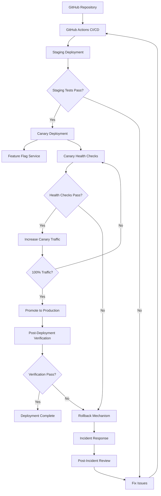

# Production Deployment and Testing Strategy

## Table of Contents
1. [Introduction](#introduction)
2. [Strategy Overview](#strategy-overview)
3. [Component Integration](#component-integration)
4. [Deployment Workflow](#deployment-workflow)
5. [Architecture Diagram](#architecture-diagram)
6. [Roles and Responsibilities](#roles-and-responsibilities)
7. [Key Metrics and Monitoring](#key-metrics-and-monitoring)
8. [Related Documentation](#related-documentation)

## Introduction

This document provides a comprehensive overview of our production deployment and testing strategy for the Next.js application deployed on Vercel. The strategy integrates several key components to ensure reliable, safe, and efficient deployments:

- Rollback Mechanism
- Production Testing Framework
- Feature Flags System
- Incident Response Playbooks
- Canary Deployment Configuration

Together, these components create a robust system for deploying changes to production with minimal risk and maximum visibility.

## Strategy Overview

Our production deployment and testing strategy is designed around the following principles:

- **Safety First**: Multiple layers of protection to prevent and mitigate issues
- **Gradual Rollout**: Controlled exposure of changes to users
- **Automated Testing**: Comprehensive testing at all stages of deployment
- **Quick Recovery**: Fast and reliable rollback mechanisms when needed
- **Visibility**: Clear monitoring and reporting throughout the process

The strategy employs a multi-environment approach with Development, Staging, and Production environments, with Canary deployments serving as an additional safety layer before full production rollout.

## Component Integration

The five key components of our strategy work together as follows:

### Rollback Mechanism

The rollback mechanism provides the safety net for our deployment process. It includes:

- Automatic detection of issues based on thresholds
- Manual approval workflow for production rollbacks
- Application code, database, and configuration rollback capabilities

**Integration Points**:
- Receives alerts from the Production Testing Framework
- Coordinates with Feature Flags for feature-level rollbacks
- Triggers Incident Response Playbooks when activated
- Provides recovery for failed Canary Deployments

### Production Testing Framework

The production testing framework validates the system in production and detects issues that might trigger the rollback mechanism. It includes:

- Smoke Tests: Basic tests to verify core functionality
- Load Tests: Tests to ensure performance under expected traffic
- Chaos Engineering Tests: Tests to validate system resilience
- A/B Testing Infrastructure: Infrastructure for testing feature variations

**Integration Points**:
- Provides health check data to the Rollback Mechanism
- Validates Canary Deployments before promotion
- Supports Feature Flag evaluation with test data
- Informs Incident Response with diagnostic information

### Feature Flags System

The feature flag system allows for controlled feature rollout and quick disabling of problematic features. It includes:

- Boolean Flags: Simple on/off toggles
- Percentage Rollouts: Gradual feature rollout
- User-Targeted Flags: Feature enabling for specific users
- Multivariate Flags: Testing multiple feature variants

**Integration Points**:
- Coordinates with Canary Deployments for feature exposure
- Provides quick mitigation options for Incident Response
- Supports the Rollback Mechanism with feature-level rollbacks
- Enables targeted testing with the Production Testing Framework

### Incident Response Playbooks

The incident response playbooks provide structured guidance for handling various types of incidents. They include:

- Incident classification system
- Response team structure
- Incident response procedures
- Communication templates
- Post-incident procedures

**Integration Points**:
- Triggered by the Rollback Mechanism when issues are detected
- Uses data from the Production Testing Framework for diagnosis
- Leverages Feature Flags for mitigation strategies
- Includes specific procedures for Canary Deployment issues

### Canary Deployment Configuration

The canary deployment system enables gradual rollout of changes to production. It includes:

- Traffic routing to canary environment
- Health check monitoring
- Metrics comparison with production
- Gradual traffic increase
- Promotion or rollback decision

**Integration Points**:
- Uses the Production Testing Framework for health checks
- Triggers the Rollback Mechanism if issues are detected
- Coordinates with Feature Flags for feature exposure
- Follows procedures from Incident Response Playbooks when issues occur

## Deployment Workflow

Our deployment workflow follows these stages:

### 1. Development Phase
- Feature development with feature flags
- Local testing
- Code review
- Unit and integration testing

### 2. Staging Deployment
- Automated deployment to staging
- Smoke tests execution
- Load tests execution
- Manual QA verification
- Feature flag testing

### 3. Canary Deployment
- Deployment to canary environment
- Initial traffic routing (5%)
- Health check monitoring
- Metrics comparison with production
- Gradual traffic increase

### 4. Production Deployment
- Promotion from canary to production
- Feature flag enablement
- Post-deployment verification
- Monitoring for issues

### 5. Incident Response (if needed)
- Automated detection of issues
- Manual approval for rollbacks
- Rollback execution if needed
- Incident classification and response
- Post-incident review

## Architecture Diagram

## Roles and Responsibilities

### Development Team
- Develop features with feature flags
- Write and execute unit and integration tests
- Perform code reviews
- Fix issues identified during testing

### QA Team
- Execute manual tests in staging
- Verify feature flag functionality
- Validate canary deployments
- Report issues found during testing

### DevOps Team
- Configure and maintain deployment pipelines
- Manage canary deployment infrastructure
- Monitor system health and performance
- Execute rollbacks when necessary

### Incident Response Team
- Respond to deployment-related incidents
- Coordinate communication during incidents
- Make decisions about rollbacks
- Conduct post-incident reviews

### Product Management
- Define feature flag rollout strategy
- Approve production deployments
- Review post-deployment metrics
- Prioritize fixes for identified issues

## Key Metrics and Monitoring

The following metrics are monitored throughout the deployment process:

### Error Metrics
- Error rate by endpoint
- Error rate by browser/device
- Error severity distribution
- New error types after deployment

### Performance Metrics
- Page load time
- Time to interactive
- API response time
- Database query performance

### User Experience Metrics
- Conversion rate
- Session duration
- Bounce rate
- Feature usage

### Infrastructure Metrics
- CPU/Memory usage
- Network throughput
- Database connections
- Cache hit ratio

## Related Documentation

For more detailed information about specific components, refer to the following documentation:

- [Rollback Mechanism Design](./rollback-mechanism-design.md)
- [Production Testing Framework](./web/docs/production-testing-framework.md)
- [Feature Flag System](./web/docs/feature-flag-system.md)
- [Incident Response Playbooks](./incident-response-playbooks.md)
- [Canary Deployment System](./web/docs/canary-deployment-system.md)

For specific procedures and guides, refer to:

- [Deployment Procedures](./deployment-procedures.md)
- [Troubleshooting Guides](./troubleshooting-guides.md)
- [Post-Deployment Validation Report Template](./post-deployment-validation-template.md)
- [Training Materials](./training/README.md)