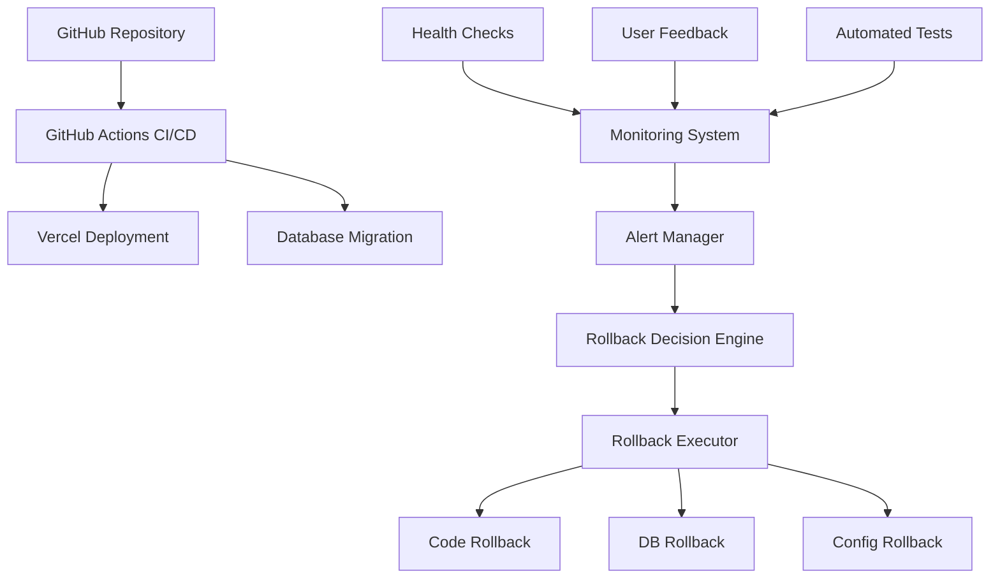
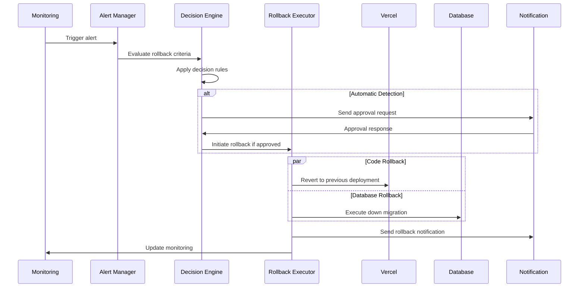
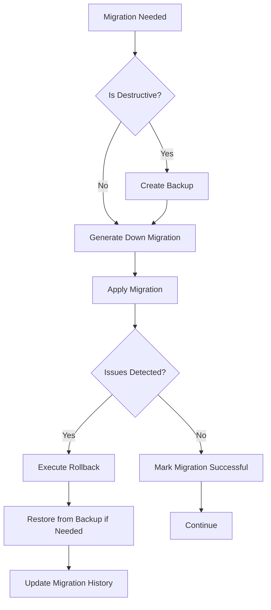

# Rollback Mechanism Design for Production Deployment Strategy

## Table of Contents
1. [Introduction](#introduction)
2. [Architecture Overview](#architecture-overview)
3. [Rollback Components](#rollback-components)
4. [Automatic Detection and Manual Approval](#automatic-detection-and-manual-approval)
5. [Database Backup Strategy](#database-backup-strategy)
6. [Rollback Procedures](#rollback-procedures)
7. [Implementation Phases](#implementation-phases)
8. [Architecture Diagrams](#architecture-diagrams)
9. [Monitoring and Alerting](#monitoring-and-alerting)
10. [Documentation and Training](#documentation-and-training)

## Introduction

This document outlines the rollback mechanism design for the Next.js application deployed on Vercel with Prisma ORM. The design addresses the current state where:

- Rollbacks are performed manually when needed
- No formal database backup strategy exists
- Feature flags are not currently implemented
- The team prefers automatic detection of issues but manual approval for production rollbacks

The rollback mechanism is designed to ensure system stability and reliability during deployments across Development, Staging, and Production environments.

## Architecture Overview

The rollback system consists of several interconnected components that work together to detect issues, facilitate decision-making, and execute rollbacks when necessary. The architecture is designed to be modular, allowing for phased implementation and future enhancements.

Key architectural principles:

- **Separation of concerns**: Monitoring, decision-making, and execution are separate components
- **Environment-specific configurations**: Different rules for Development, Staging, and Production
- **Audit trail**: All rollback-related activities are logged for analysis
- **Graceful degradation**: System continues to function even if some components fail
- **Extensibility**: Architecture allows for future enhancements like feature flags

## Rollback Components

### 1. Monitoring and Alert System

- Integration with Sentry for error tracking
- Custom metrics in Vercel Analytics
- Health checks for critical services
- API endpoint monitoring
- User experience metrics

### 2. Rollback Decision Engine

- Rule-based evaluation of monitoring data
- Automatic detection of issues based on thresholds
- Manual approval workflow for production rollbacks
- Audit logging of all decisions
- Notification system for stakeholders

### 3. Rollback Executor

- Code rollback via Vercel API
- Database rollback via migration scripts
- Configuration rollback
- Verification of rollback success
- Notification of rollback completion

### 4. Database Management

- Automated backup system
- Migration script generation
- Down migration execution
- Data integrity verification
- Backup restoration procedures

## Automatic Detection and Manual Approval

The system implements a hybrid approach that automatically detects issues but requires manual approval for production rollbacks:

### Automatic Detection Criteria

1. **Error Rate Thresholds**:
   - Sudden spike in error rates (e.g., 10x normal rate)
   - Sustained elevated error rates (e.g., >5% for 5 minutes)
   - Critical errors affecting core functionality

2. **Performance Degradation**:
   - Response time increases beyond acceptable thresholds
   - Server-side rendering time increases significantly
   - API endpoint timeouts or failures

3. **Availability Issues**:
   - Health check failures
   - Database connection failures
   - External service integration failures

4. **User Impact Metrics**:
   - Session abandonment rate increases
   - Conversion rate drops significantly
   - User-reported critical issues

5. **Deployment Verification**:
   - Post-deployment test failures
   - Smoke test failures
   - Integration test failures

### Manual Approval Workflow

1. Issue detected by monitoring system
2. Alert generated with severity level
3. Decision engine evaluates against rollback criteria
4. If criteria met, notification sent to approvers
5. Approvers review data and make decision
6. If approved, rollback executed
7. If rejected, incident tracked for resolution

For Development and Staging environments, automatic rollbacks can be configured without manual approval for specific high-severity issues.

## Database Backup Strategy

A formal database backup strategy is a priority component of the rollback mechanism:

### Backup Types and Frequency

1. **Full Backups**:
   - Daily full backups of all databases
   - Retained for 30 days
   - Encrypted at rest

2. **Point-in-Time Recovery**:
   - Transaction log backups every 15 minutes
   - Allows recovery to any point in time
   - Retained for 7 days

3. **Pre-Migration Backups**:
   - Full backup before any schema migration
   - Tagged with migration identifier
   - Retained until next major version

### Backup Storage

1. **Primary Storage**:
   - Vercel Postgres built-in backup system
   - Automated through Vercel dashboard

2. **Secondary Storage**:
   - External storage service (e.g., AWS S3)
   - Different security credentials
   - Cross-region replication

### Backup Testing and Verification

1. **Regular Restore Testing**:
   - Monthly restore tests to verify backup integrity
   - Automated verification of restored data
   - Documentation of restore procedures

2. **Backup Monitoring**:
   - Alerts for failed backups
   - Size and time monitoring
   - Backup storage capacity planning

## Rollback Procedures

### 1. Application Code Rollback

**Trigger Conditions**:
- Error rates exceed thresholds
- Critical functionality broken
- Security vulnerability discovered
- Manual decision by operations team

**Procedure**:
1. Identify the last known good deployment
2. Initiate rollback via Vercel API or dashboard
3. Verify application functionality after rollback
4. Notify team of rollback event
5. Document incident for post-mortem analysis

**Implementation**:
```javascript
// Example Vercel API rollback implementation
import { Vercel } from "@vercel/sdk";

const vercel = new Vercel({
  bearerToken: process.env.VERCEL_TOKEN,
});

async function rollbackDeployment(projectId, deploymentId) {
  try {
    // Get the last successful deployment before the problematic one
    const deployments = await vercel.deployments.listDeployments({
      projectId,
      limit: 10,
    });
    
    const lastGoodDeployment = deployments.find(d => 
      d.state === "READY" && d.id !== deploymentId
    );
    
    if (!lastGoodDeployment) {
      throw new Error("No suitable deployment found for rollback");
    }
    
    // Rollback to the last good deployment
    await vercel.aliases.updateAlias({
      aliasId: "production",
      deploymentId: lastGoodDeployment.id,
    });
    
    console.log(`Rolled back to deployment ${lastGoodDeployment.id}`);
    return lastGoodDeployment.id;
  } catch (error) {
    console.error("Rollback failed:", error);
    throw error;
  }
}
```

### 2. Database Migration Rollback

**Trigger Conditions**:
- Data integrity issues after migration
- Performance degradation after schema change
- Application errors related to database changes
- Coordinated rollback with application code

**Procedure**:
1. Execute pre-generated down migration SQL scripts
2. Verify data integrity after rollback
3. If data integrity issues occur, restore from backup
4. Update migration history in _prisma_migrations table
5. Coordinate with code rollback to ensure compatibility

**Implementation**:
```javascript
// Example database rollback script
import { execSync } from 'child_process';
import { PrismaClient } from '@prisma/client';

const prisma = new PrismaClient();

async function rollbackMigration(migrationName) {
  try {
    // Generate down migration SQL
    const downSql = execSync(`
      npx prisma migrate diff \
        --from-schema-datamodel prisma/schema.prisma \
        --to-migrations prisma/migrations \
        --script > down.sql
    `);
    
    // Execute down migration
    await prisma.$executeRawUnsafe(`
      -- Execute down migration SQL
      ${downSql}
      
      -- Update migration history
      DELETE FROM _prisma_migrations 
      WHERE migration_name = '${migrationName}';
    `);
    
    console.log(`Migration ${migrationName} rolled back successfully`);
  } catch (error) {
    console.error("Migration rollback failed:", error);
    
    // Attempt to restore from backup if rollback fails
    await restoreFromBackup();
    
    throw error;
  }
}

async function restoreFromBackup() {
  // Implementation depends on backup strategy
  console.log("Restoring from backup...");
}
```

### 3. Configuration Rollback

**Trigger Conditions**:
- Configuration changes causing application issues
- Security concerns with configuration values
- Performance issues related to configuration
- Coordinated rollback with code or database

**Procedure**:
1. Identify the last known good configuration
2. Revert environment variables to previous values
3. Verify application functionality with reverted configuration
4. Document configuration change and rollback

**Implementation**:
```javascript
// Example configuration rollback
import { Vercel } from "@vercel/sdk";

const vercel = new Vercel({
  bearerToken: process.env.VERCEL_TOKEN,
});

async function rollbackConfiguration(projectId, configVersion) {
  try {
    // Get configuration history
    const configHistory = await vercel.projects.getProjectEnvVars({
      projectId,
    });
    
    // Find the target configuration version
    const targetConfig = configHistory.find(c => c.version === configVersion);
    
    if (!targetConfig) {
      throw new Error(`Configuration version ${configVersion} not found`);
    }
    
    // Apply the target configuration
    await vercel.projects.updateProjectEnvVars({
      projectId,
      envVars: targetConfig.envVars,
    });
    
    console.log(`Configuration rolled back to version ${configVersion}`);
  } catch (error) {
    console.error("Configuration rollback failed:", error);
    throw error;
  }
}
```

## Implementation Phases

The rollback mechanism will be implemented in phases to ensure a stable and gradual adoption:

### Phase 1: Foundation (Months 1-2)

**Objectives**:
- Establish database backup strategy
- Implement basic monitoring with Sentry
- Document manual rollback procedures
- Set up notification system for alerts

**Key Deliverables**:
- Database backup automation scripts
- Sentry integration for error tracking
- Runbooks for manual rollback procedures
- Slack/Email notification system

### Phase 2: Automation (Months 3-4)

**Objectives**:
- Implement automatic issue detection
- Create database migration rollback scripts
- Extend CI/CD pipeline with verification tests
- Implement configuration versioning

**Key Deliverables**:
- Monitoring dashboards and alerts
- Database migration rollback automation
- Post-deployment verification tests
- Configuration version control

### Phase 3: Advanced Features (Months 5-6)

**Objectives**:
- Implement approval workflows for production rollbacks
- Add progressive rollout capabilities
- Implement feature flags for granular control
- Create comprehensive dashboards

**Key Deliverables**:
- Approval workflow system
- Canary deployment configuration
- Feature flag system
- Comprehensive monitoring dashboards

## Architecture Diagrams

### System Architecture



### Rollback Process Flow



### Database Rollback Strategy



## Monitoring and Alerting

### Metrics to Monitor

1. **Error Metrics**:
   - Error rate by endpoint
   - Error rate by browser/device
   - Error severity distribution
   - New error types after deployment

2. **Performance Metrics**:
   - Page load time
   - Time to interactive
   - API response time
   - Database query performance

3. **User Experience Metrics**:
   - Conversion rate
   - Session duration
   - Bounce rate
   - Feature usage

4. **Infrastructure Metrics**:
   - CPU/Memory usage
   - Network throughput
   - Database connections
   - Cache hit ratio

### Alert Thresholds

| Metric | Warning Threshold | Critical Threshold | Action |
|--------|-------------------|-------------------|--------|
| Error Rate | 2% of requests | 5% of requests | Alert, Evaluate for rollback |
| P95 Response Time | >500ms | >1000ms | Alert, Investigate |
| Failed Health Checks | 1 failure | 3 consecutive failures | Alert, Evaluate for rollback |
| Database Errors | >10/minute | >50/minute | Alert, Evaluate for rollback |
| Memory Usage | >80% | >90% | Alert, Scale if needed |

### Notification Channels

- **Slack**: Real-time alerts and rollback approvals
- **Email**: Detailed incident reports
- **Dashboard**: Visual monitoring of system health
- **SMS**: Critical alerts for on-call personnel

## Documentation and Training

### Runbooks

1. **Rollback Decision Runbook**:
   - Criteria for evaluating rollback necessity
   - Decision-making process and responsibilities
   - Approval workflow for production rollbacks

2. **Code Rollback Runbook**:
   - Step-by-step procedure for Vercel rollbacks
   - Verification steps after rollback
   - Troubleshooting common issues

3. **Database Rollback Runbook**:
   - Procedures for executing down migrations
   - Backup restoration process
   - Data integrity verification

4. **Post-Incident Analysis Runbook**:
   - Data collection for incident analysis
   - Root cause analysis process
   - Continuous improvement process

### Training

1. **Developer Training**:
   - Writing reversible migrations
   - Testing deployment and rollback locally
   - Monitoring and alerting basics

2. **Operations Training**:
   - Rollback decision-making
   - Executing rollbacks safely
   - Post-incident analysis

3. **Stakeholder Training**:
   - Understanding rollback implications
   - Communication during incidents
   - Approval process for production rollbacks