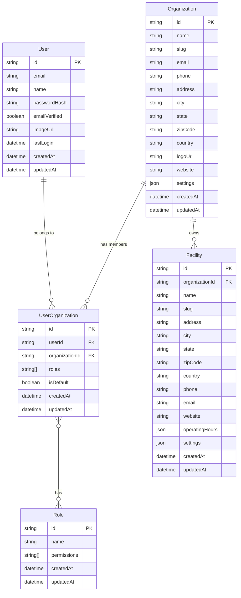

[2025-05-20 14:32:04] - # Data Model

## Overview

This document outlines the data model for the Pickleball Facility Owner Platform, focusing on the first implementation slice. It defines the core entities, their relationships, and attributes to support organization management, user authentication, and facility management.

## Entity Relationship Diagram



## Prisma Schema

```prisma
// This is the Prisma schema for the Pickleball Facility Owner Platform

generator client {
  provider = "prisma-client-js"
}

datasource db {
  provider = "postgresql"
  url      = env("DATABASE_URL")
}

model Organization {
  id         String   @id @default(cuid())
  name       String
  slug       String   @unique
  email      String?
  phone      String?
  address    String?
  city       String?
  state      String?
  zipCode    String?
  country    String?
  logoUrl    String?
  website    String?
  settings   Json?    @default("{}") // JSON for flexible settings
  createdAt  DateTime @default(now())
  updatedAt  DateTime @updatedAt

  // Relations
  members    UserOrganization[]
  facilities Facility[]

  @@index([slug])
}

model User {
  id            String    @id @default(cuid())
  email         String    @unique
  name          String?
  passwordHash  String?
  emailVerified Boolean   @default(false)
  imageUrl      String?
  lastLogin     DateTime?
  createdAt     DateTime  @default(now())
  updatedAt     DateTime  @updatedAt

  // Relations
  organizations UserOrganization[]

  @@index([email])
}

model UserOrganization {
  id             String       @id @default(cuid())
  userId         String
  organizationId String
  roles          String[]    // Array of role names
  isDefault      Boolean     @default(false) // Is this the user's default organization
  createdAt      DateTime    @default(now())
  updatedAt      DateTime    @updatedAt

  // Relations
  user           User         @relation(fields: [userId], references: [id], onDelete: Cascade)
  organization   Organization @relation(fields: [organizationId], references: [id], onDelete: Cascade)

  @@unique([userId, organizationId])
  @@index([userId])
  @@index([organizationId])
}

model Facility {
  id             String       @id @default(cuid())
  organizationId String
  name           String
  slug           String
  address        String?
  city           String?
  state          String?
  zipCode        String?
  country        String?
  phone          String?
  email          String?
  website        String?
  operatingHours Json?        @default("{}") // JSON for flexible operating hours
  settings       Json?        @default("{}") // JSON for flexible settings
  createdAt      DateTime     @default(now())
  updatedAt      DateTime     @updatedAt

  // Relations
  organization   Organization @relation(fields: [organizationId], references: [id], onDelete: Cascade)

  @@unique([organizationId, slug])
  @@index([organizationId])
  @@index([slug])
}

model Role {
  id          String   @id @default(cuid())
  name        String   @unique
  permissions String[] // Array of permission names
  createdAt   DateTime @default(now())
  updatedAt   DateTime @updatedAt

  @@index([name])
}
```

## Entity Descriptions

### Organization

Represents a pickleball business entity that owns and manages facilities. This is the primary tenant entity in the multi-tenant architecture.

**Key Attributes**:
- `id`: Unique identifier
- `name`: Organization name
- `slug`: URL-friendly unique identifier
- `email`: Primary contact email
- `settings`: JSON field for flexible configuration options

**Relationships**:
- Has many UserOrganization (members)
- Has many Facility (facilities)

### User

Represents an individual user who can access the platform. Users can belong to multiple organizations with different roles.

**Key Attributes**:
- `id`: Unique identifier
- `email`: User's email address (used for authentication)
- `name`: User's full name
- `passwordHash`: Hashed password (if using password authentication)
- `emailVerified`: Whether the user's email has been verified

**Relationships**:
- Has many UserOrganization (organizations)

### UserOrganization

Junction entity that represents a user's membership in an organization, including their roles within that organization.

**Key Attributes**:
- `id`: Unique identifier
- `userId`: Reference to the User
- `organizationId`: Reference to the Organization
- `roles`: Array of role names assigned to the user in this organization
- `isDefault`: Whether this is the user's default organization

**Relationships**:
- Belongs to User
- Belongs to Organization

### Facility

Represents a physical pickleball facility owned by an organization.

**Key Attributes**:
- `id`: Unique identifier
- `organizationId`: Reference to the owning Organization
- `name`: Facility name
- `slug`: URL-friendly identifier (unique within an organization)
- `address`, `city`, `state`, `zipCode`, `country`: Location information
- `operatingHours`: JSON field for flexible operating hours configuration
- `settings`: JSON field for facility-specific settings

**Relationships**:
- Belongs to Organization

### Role

Defines a set of permissions that can be assigned to users within an organization.

**Key Attributes**:
- `id`: Unique identifier
- `name`: Role name (e.g., "Admin", "Manager", "Staff")
- `permissions`: Array of permission names granted by this role

## Multi-tenant Considerations

1. **Data Isolation**: All tenant-specific data includes an `organizationId` to ensure proper isolation between tenants.

2. **Indexes**: All tables have appropriate indexes on `organizationId` and other frequently queried fields to ensure good performance.

3. **Unique Constraints**: Where appropriate, unique constraints are scoped to an organization (e.g., facility slugs are unique within an organization).

4. **Cascading Deletes**: Relationships use cascading deletes to ensure data integrity when parent records are deleted.

5. **JSON Fields**: Flexible attributes are stored as JSON to allow for extensibility without schema changes.

## Authentication and Authorization

1. **Authentication**: Users authenticate with email/password or OAuth providers via Auth.js (NextAuth).

2. **Organization Context**: After authentication, users select an organization context, which is stored in their session.

3. **Authorization**: Access control is based on the user's roles within the current organization context.

4. **Role-Based Access Control**: Permissions are granted through roles assigned to users within each organization.

## Data Access Patterns

1. **Organization-Scoped Queries**: All queries include the current organization ID to ensure data isolation.

2. **User Profile**: User profile data is shared across organizations but organization-specific settings are isolated.

3. **Default Organization**: Users can have a default organization that is automatically selected after login.

4. **Cross-Organization Access**: Users with accounts in multiple organizations can switch between them without re-authenticating.
