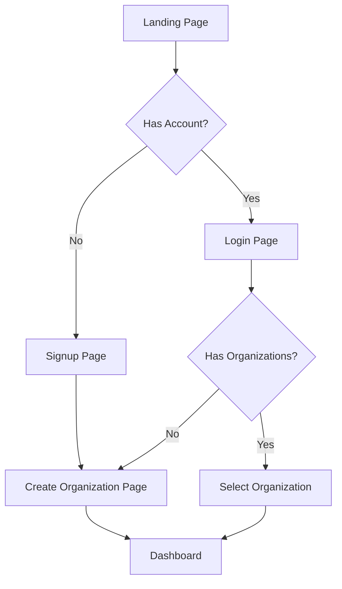
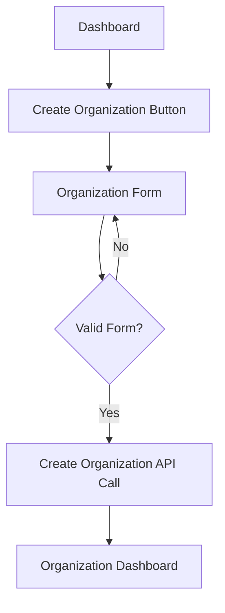
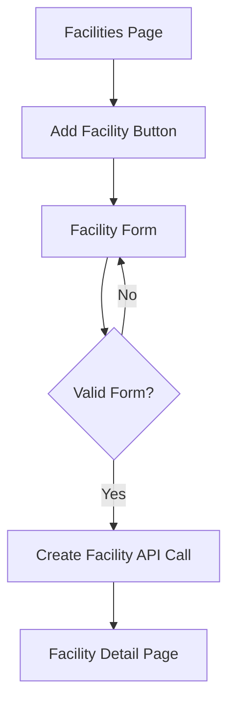
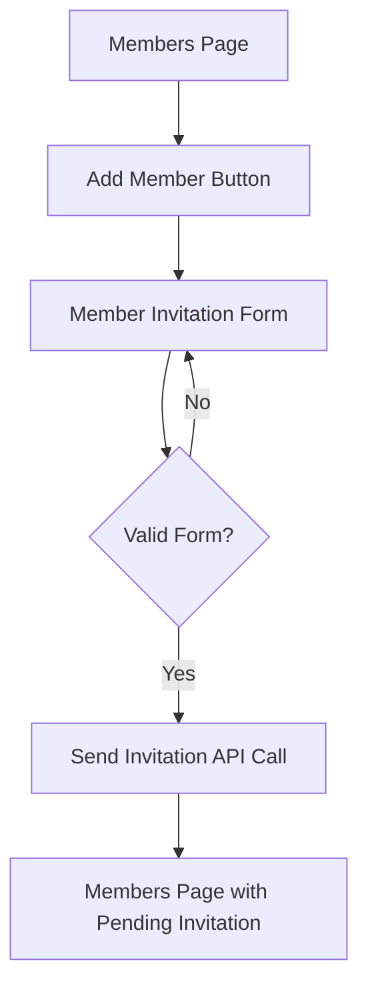

[2025-05-20 14:33:53] - # UI/UX Design

## Overview

This document outlines the UI/UX design approach for the Pickleball Facility Owner Platform, focusing on the first implementation slice. It defines the design system, component library, page layouts, and user flows to support organization management, user authentication, and facility management.

## Design System

### Technology Stack

- **Framework**: Next.js with App Router
- **Styling**: Tailwind CSS
- **Component Library**: shadcn/ui
- **Icons**: Lucide Icons
- **Typography**: Inter font family

### Color Palette

```css
/* Primary Colors */
--primary: #22c55e; /* Green-500 */
--primary-foreground: #ffffff;

/* Secondary Colors */
--secondary: #0ea5e9; /* Sky-500 */
--secondary-foreground: #ffffff;

/* Accent Colors */
--accent: #f59e0b; /* Amber-500 */
--accent-foreground: #ffffff;

/* Background Colors */
--background: #ffffff;
--foreground: #0f172a; /* Slate-900 */

/* Muted Colors */
--muted: #f1f5f9; /* Slate-100 */
--muted-foreground: #64748b; /* Slate-500 */

/* Card Colors */
--card: #ffffff;
--card-foreground: #0f172a; /* Slate-900 */

/* Border Colors */
--border: #e2e8f0; /* Slate-200 */

/* Input Colors */
--input: #e2e8f0; /* Slate-200 */
--ring: #22c55e; /* Green-500 */

/* Destructive Colors */
--destructive: #ef4444; /* Red-500 */
--destructive-foreground: #ffffff;

/* Success Colors */
--success: #22c55e; /* Green-500 */
--success-foreground: #ffffff;

/* Warning Colors */
--warning: #f59e0b; /* Amber-500 */
--warning-foreground: #ffffff;

/* Info Colors */
--info: #0ea5e9; /* Sky-500 */
--info-foreground: #ffffff;
```

### Typography

```css
/* Headings */
h1 {
  font-size: 2.25rem; /* 36px */
  line-height: 2.5rem; /* 40px */
  font-weight: 700;
  letter-spacing: -0.025em;
}

h2 {
  font-size: 1.875rem; /* 30px */
  line-height: 2.25rem; /* 36px */
  font-weight: 700;
  letter-spacing: -0.025em;
}

h3 {
  font-size: 1.5rem; /* 24px */
  line-height: 2rem; /* 32px */
  font-weight: 600;
}

h4 {
  font-size: 1.25rem; /* 20px */
  line-height: 1.75rem; /* 28px */
  font-weight: 600;
}

/* Body Text */
p {
  font-size: 1rem; /* 16px */
  line-height: 1.5rem; /* 24px */
}

.text-sm {
  font-size: 0.875rem; /* 14px */
  line-height: 1.25rem; /* 20px */
}

.text-xs {
  font-size: 0.75rem; /* 12px */
  line-height: 1rem; /* 16px */
}
```

### Spacing System

Based on Tailwind CSS's default spacing scale:

```
0: 0px
1: 0.25rem (4px)
2: 0.5rem (8px)
3: 0.75rem (12px)
4: 1rem (16px)
5: 1.25rem (20px)
6: 1.5rem (24px)
8: 2rem (32px)
10: 2.5rem (40px)
12: 3rem (48px)
16: 4rem (64px)
20: 5rem (80px)
24: 6rem (96px)
```

### Responsive Breakpoints

```
sm: 640px
md: 768px
lg: 1024px
xl: 1280px
2xl: 1536px
```

## Component Library

The platform will use shadcn/ui components, customized with the design system's color palette and styling. Key components include:

### Layout Components

- **AppShell**: Main application layout with sidebar navigation
- **PageHeader**: Consistent page header with title, description, and actions
- **PageContainer**: Container with consistent padding and max-width
- **Card**: Container for content sections
- **Tabs**: For organizing related content

### Form Components

- **Input**: Text input fields
- **Select**: Dropdown selection
- **Checkbox**: Boolean selection
- **RadioGroup**: Single selection from multiple options
- **Switch**: Toggle control
- **Textarea**: Multi-line text input
- **DatePicker**: Date selection
- **TimePicker**: Time selection
- **Form**: Form container with validation

### Navigation Components

- **Sidebar**: Main navigation sidebar
- **Breadcrumbs**: Page location indicator
- **Pagination**: For paginated content
- **Tabs**: For switching between related views

### Feedback Components

- **Alert**: For important messages
- **Toast**: For temporary notifications
- **Dialog**: For confirmations and important actions
- **Progress**: For showing progress
- **Skeleton**: For loading states

### Data Display Components

- **Table**: For tabular data
- **DataGrid**: For complex data with sorting and filtering
- **List**: For simple lists
- **Badge**: For status indicators
- **Avatar**: For user profiles
- **Calendar**: For date-based views

## Page Layouts

### Authentication Pages

**Login Page**
```
+----------------------------------+
|                                  |
|  +----------------------------+  |
|  |                            |  |
|  |  Logo                      |  |
|  |                            |  |
|  |  Welcome back              |  |
|  |                            |  |
|  |  Email                     |  |
|  |  [                    ]    |  |
|  |                            |  |
|  |  Password                  |  |
|  |  [                    ]    |  |
|  |                            |  |
|  |  [Remember me]             |  |
|  |                            |  |
|  |  [Sign In]                 |  |
|  |                            |  |
|  |  Forgot password?          |  |
|  |                            |  |
|  |  Don't have an account?    |  |
|  |  Sign up                   |  |
|  |                            |  |
|  +----------------------------+  |
|                                  |
+----------------------------------+
```

**Signup Page**
```
+----------------------------------+
|                                  |
|  +----------------------------+  |
|  |                            |  |
|  |  Logo                      |  |
|  |                            |  |
|  |  Create an account         |  |
|  |                            |  |
|  |  Name                      |  |
|  |  [                    ]    |  |
|  |                            |  |
|  |  Email                     |  |
|  |  [                    ]    |  |
|  |                            |  |
|  |  Password                  |  |
|  |  [                    ]    |  |
|  |                            |  |
|  |  [Sign Up]                 |  |
|  |                            |  |
|  |  Already have an account?  |  |
|  |  Sign in                   |  |
|  |                            |  |
|  +----------------------------+  |
|                                  |
+----------------------------------+
```

### Main Application Layout

```
+----------------------------------+
|  Header                          |
+------+---------------------------+
|      |                           |
|      |                           |
|      |                           |
|      |                           |
|      |                           |
|      |                           |
|      |                           |
| Side |       Content Area        |
| bar  |                           |
|      |                           |
|      |                           |
|      |                           |
|      |                           |
|      |                           |
|      |                           |
+------+---------------------------+
```

### Dashboard Page

```
+----------------------------------+
|  Header                          |
+------+---------------------------+
|      |                           |
|      | Dashboard                 |
|      |                           |
|      | +-----+ +-----+ +-----+   |
|      | |     | |     | |     |   |
|      | |     | |     | |     |   |
|      | +-----+ +-----+ +-----+   |
| Side |                           |
| bar  | Recent Activity           |
|      | +---------------------+   |
|      | |                     |   |
|      | |                     |   |
|      | +---------------------+   |
|      |                           |
|      |                           |
+------+---------------------------+
```

### Organization Profile Page

```
+----------------------------------+
|  Header                          |
+------+---------------------------+
|      |                           |
|      | Organization Profile      |
|      |                           |
|      | +---------------------+   |
|      | | Organization Info   |   |
|      | |                     |   |
|      | +---------------------+   |
| Side |                           |
| bar  | +---------------------+   |
|      | | Organization Settings|   |
|      | |                     |   |
|      | +---------------------+   |
|      |                           |
|      |                           |
|      |                           |
+------+---------------------------+
```

### Facilities List Page

```
+----------------------------------+
|  Header                          |
+------+---------------------------+
|      |                           |
|      | Facilities                |
|      |                           |
|      | [+ Add Facility]          |
|      |                           |
|      | +---------------------+   |
|      | | Facility 1          |   |
|      | +---------------------+   |
| Side |                           |
| bar  | +---------------------+   |
|      | | Facility 2          |   |
|      | +---------------------+   |
|      |                           |
|      | +---------------------+   |
|      | | Facility 3          |   |
|      | +---------------------+   |
+------+---------------------------+
```

### Facility Detail Page

```
+----------------------------------+
|  Header                          |
+------+---------------------------+
|      |                           |
|      | Facility Name             |
|      |                           |
|      | [General] [Settings]      |
|      |                           |
|      | +---------------------+   |
|      | | Facility Information |   |
|      | |                     |   |
| Side | +---------------------+   |
| bar  |                           |
|      | +---------------------+   |
|      | | Operating Hours     |   |
|      | |                     |   |
|      | +---------------------+   |
|      |                           |
|      |                           |
+------+---------------------------+
```

### Organization Members Page

```
+----------------------------------+
|  Header                          |
+------+---------------------------+
|      |                           |
|      | Members                   |
|      |                           |
|      | [+ Add Member]            |
|      |                           |
|      | +---------------------+   |
|      | | Name | Email | Role |   |
|      | |-----|-------|------|   |
| Side | | John | ...   | Admin|   |
| bar  | |-----|-------|------|   |
|      | | Jane | ...   | Staff|   |
|      | |-----|-------|------|   |
|      | | Bob  | ...   | Staff|   |
|      | +---------------------+   |
|      |                           |
|      |                           |
+------+---------------------------+
```

## User Flows

### Authentication Flow



### Organization Creation Flow



### Facility Creation Flow



### Member Invitation Flow



## Responsive Design Approach

The platform will follow a mobile-first approach with responsive design considerations:

1. **Mobile (< 640px)**:
   - Stacked layouts
   - Full-width components
   - Hamburger menu for navigation
   - Simplified tables with cards

2. **Tablet (640px - 1024px)**:
   - Two-column layouts where appropriate
   - Sidebar navigation (collapsible)
   - Responsive tables

3. **Desktop (> 1024px)**:
   - Multi-column layouts
   - Persistent sidebar navigation
   - Full data tables and grids

## Accessibility Considerations

1. **Color Contrast**: All text meets WCAG AA standards for contrast
2. **Keyboard Navigation**: All interactive elements are keyboard accessible
3. **Screen Reader Support**: Proper ARIA labels and semantic HTML
4. **Focus Management**: Visible focus indicators for all interactive elements
5. **Responsive Text**: Text scales appropriately across devices
6. **Alternative Text**: All images have appropriate alt text

## Implementation Approach

1. **Component Library Setup**:
   - Install and configure shadcn/ui
   - Customize theme to match design system
   - Create reusable layout components

2. **Page Implementation**:
   - Implement authentication pages
   - Create main application layout
   - Implement core pages for organization and facility management

3. **Responsive Implementation**:
   - Use Tailwind's responsive utilities
   - Test across device sizes
   - Implement device-specific optimizations

4. **Accessibility Implementation**:
   - Conduct accessibility audits
   - Implement accessibility improvements
   - Test with screen readers and keyboard navigation
